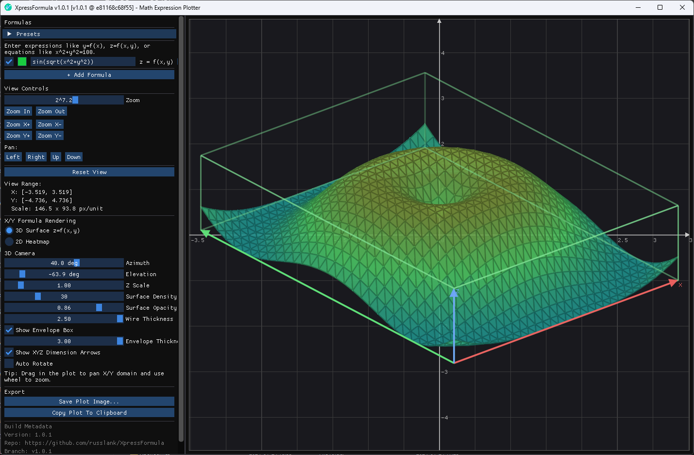

<!-- SPDX-License-Identifier: MIT -->
# XpressFormula

XpressFormula is a Windows desktop proof-of-concept for entering and plotting mathematical expressions with an ImGui-based UI.

The app supports:

- `y=f(x)` 2D curves
- `z=f(x,y)` 3D surfaces (with optional 2D heat-map view)
- `F(x,y)=0` implicit 2D equations such as `x^2+y^2=100`
- `f(x,y,z)` scalar-field cross-sections at configurable `z` slices
- `F(x,y,z)=0` implicit 3D surfaces (e.g. spheres and torus equations)
- Auto/Force 2D/3D rendering preference with projected 3D grid-plane interleaving (`z=0`) for clearer depth ordering
- Plot export dialog (size/aspect, color or grayscale, background color, include/exclude grid/coordinates/wires) with `.png`/`.bmp` save and clipboard copy
- Startup/manual update checks against GitHub releases with quick link to the releases page
- Versioned binary metadata and installer packaging (`.msi` + setup `.exe`)

## Screenshots

| Formula View | Surface/Heatmap View |
|---|---|
|  |  |

## Project Goals

- Fast interactive plotting in a native C++ application
- Clear separation between parsing/evaluation logic and UI/rendering
- Simple local development workflow (Visual Studio, VS Code, CLI)
- Solid unit/integration test coverage for core math and transform logic

## Requirements

- Windows 10/11
- Visual Studio 2022/2026 with C++ workload
- Windows SDK (10.0+)

## Quick Start

Use the detailed guide:

- [`doc/run-guide.md`](doc/run-guide.md)

Common path:

1. Build `Debug|x64`
2. Run `src\x64\Debug\XpressFormula.exe`
3. Run tests with `src\x64\Debug\XpressFormula.Tests.exe`

## Repository Layout

- [`src/XpressFormula`](src/XpressFormula) application code
- [`src/XpressFormula.Tests`](src/XpressFormula.Tests) test runner and tests
- [`src/vendor/imgui`](src/vendor/imgui) vendored Dear ImGui
- [`doc`](doc) project documentation
- shared `VS Code` build/run/debug workspace configs in `.vscode/` (tasks, launch, extension recommendations, IntelliSense config, minimal workspace settings; optional alternative to Visual Studio)

## Documentation

- Documentation index: [`doc/index.md`](doc/index.md)
- Run and debug guide: [`doc/run-guide.md`](doc/run-guide.md)
- Architecture overview: [`doc/architecture.md`](doc/architecture.md)
- Math API guide (internal math abstractions and APIs): [`doc/math-api-guide.md`](doc/math-api-guide.md)
- Math API cheatsheet (quick reference + where used): [`doc/math-api-cheatsheet.md`](doc/math-api-cheatsheet.md)
- Algorithms guide (parsing/rendering/meshing): [`doc/algorithms-guide.md`](doc/algorithms-guide.md)
- ImGui implementation guide (UI architecture/patterns): [`doc/imgui-implementation-guide.md`](doc/imgui-implementation-guide.md)
- Linux portability plan (ImGui/Linux migration roadmap): [`doc/linux-portability-plan.md`](doc/linux-portability-plan.md)
- Expression language reference: [`doc/expression-language.md`](doc/expression-language.md)
- Testing guide: [`doc/testing.md`](doc/testing.md)
- Release and packaging guide: [`doc/release-packaging.md`](doc/release-packaging.md)
- Windows code signing guide (Defender/SmartScreen mitigation): [`doc/code-signing.md`](doc/code-signing.md)
- Vendor dependencies: [`doc/project-vendors.md`](doc/project-vendors.md)

## Third-Party Dependencies

This repository vendors Dear ImGui.
See [`doc/project-vendors.md`](doc/project-vendors.md) for source, license, and update notes.

## Notes

- `dotnet build` is not the primary build path for this native C++ solution; use MSBuild/Visual Studio.
- In Debug builds, the app attempts to use the Direct3D debug layer and falls back when unavailable.
- Build metadata (`repo URL`, `branch`, `version`, `commit`) is shown in the application UI when provided by the build pipeline.

## License

This project is licensed under the MIT License. See [`LICENSE`](LICENSE).
